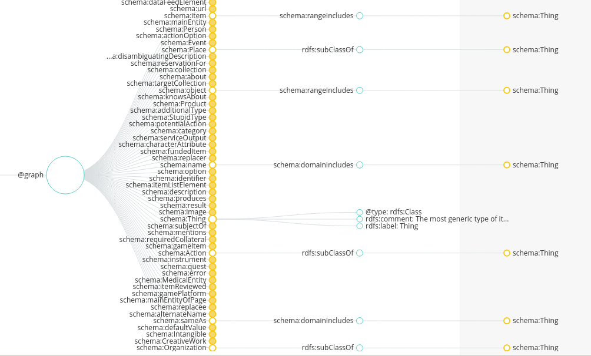
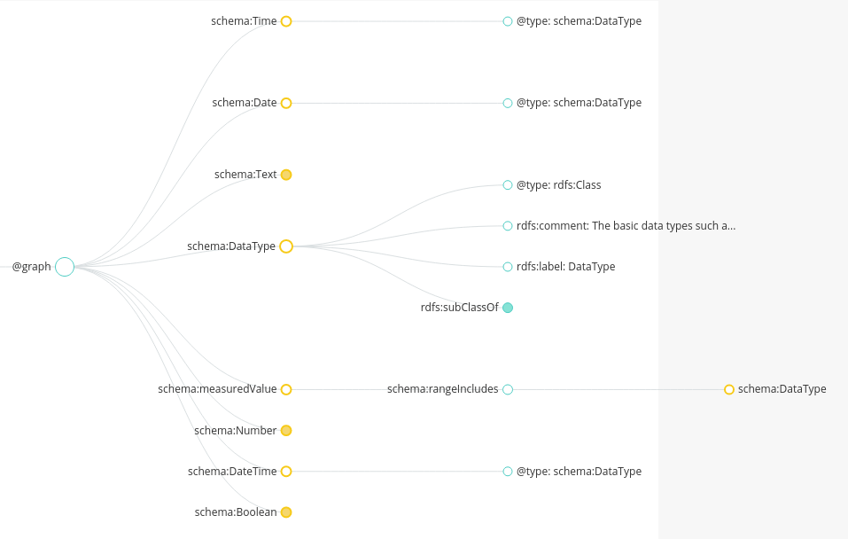
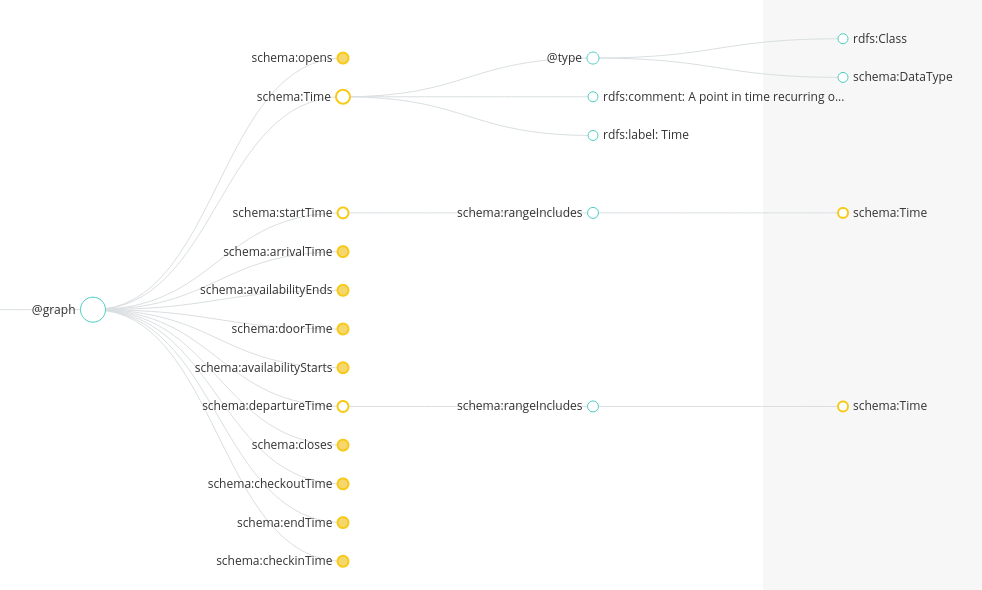
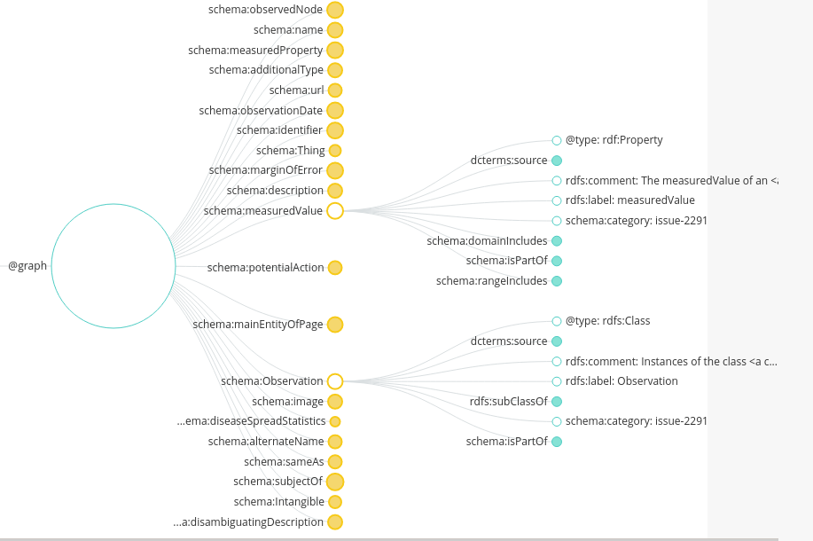

# Table of Contents

1.  [IUDX Migrating to better linked data](#org50dae70)
2.  [Getting started](#orge78bc7d)
    1.  [Basic items](#orgbb2f0ae)
        1.  [Following schema.org json-ld form](#orgc2377ad)
        2.  [Do we use schema.org standard terminologies such as &ldquo;Thing&rdquo; instead of ResourceItem?](#orge7584fa)
    2.  [Basic Types](#orgd11e069)
        1.  [schema:measuredValue is essentially iudx:QuantitativeProperty](#orga12688b)
        2.  [Datatypes in schema.org use schema:DataType](#org0bd2a0a)
        3.  [What this means](#org7fc36c4)
        4.  [schema.org is flexible is a little ambiguous](#org0c52e1e)
        5.  [According to this, time is a measured value and therefore, iudx:TimeProperty will be invalidated.](#org04633b4)
    3.  [A higher level to measuredValue](#org9b9f7da)
        1.  [Observation - This is what QuantitativeProperty should be. This is in the pending list along with measuredValue](#org2934696)
3.  [List of IUDX properties and their mappings](#org89ea81c)
    1.  [schema.org meta includes - Class, Property, domainIncludes, supersededBy (rangeIncludes??)](#org1b56c21)
    2.  [We need to differentiate between Observation and QuantitativeValue. All Observations are Quantitative and the reverse is not true](#org3f1ed95)
    3.  [schema:StructuredValue seems to be subclass of most of the properties we are intereseted in](#org9914b29)
    4.  [Example of a few derived attributes](#orga9b694d)

# IUDX Migrating to better linked data

# Getting started

## Basic items

### Following schema.org [json-ld form](https://schema.org/)

### Do we use schema.org standard terminologies such as [&ldquo;Thing&rdquo;](https://schema.org/Thing.jsonld) instead of ResourceItem?

1.  JSON

        {
            "@context": {
                "schema": "http://schema.org/"
            },
            "@graph": [
                {
                    "@id": "schema:dataFeedElement",
                    "schema:rangeIncludes": {
                        "@id": "schema:Thing"
                    }
                },
                {
                    "@id": "schema:name",
                    "schema:domainIncludes": {
                        "@id": "schema:Thing"
                    }
                }
            ]
        }

2.  LD Expansion

    

## Basic Types

### schema:measuredValue is essentially iudx:QuantitativeProperty

### Datatypes in schema.org use schema:DataType

### What this means

1.  JSON

        {
            "@context": {
                "schema": "http://schema.org/"
            },
            "@graph": [
                {
                    "@id": "schema:measuredValue",
                    "schema:rangeIncludes": {
                        "@id": "schema:DataType"
                    }
                },
                {
                    "@id": "schema:DataType",
                    "@type": "rdf:Class",
                    "rdf:comment": "The basic data types such as Integers, Strings, etc.",
                    "rdf:label": "DataType",
                    "rdf:subClassOf": {
                        "@id": "rdf:Class"
                    }
                },
                {
                    "@id": "schema:Number",
                    "@type": "schema:DataType"
                }
        
            ]
        }
    
    

### schema.org is flexible is a little ambiguous

1.  measuredValue doesn&rsquo;t have rdf:subclass or type

2.  DataType is of @type and subclass off rdf:class&#x2026; why?.. why not rdfs:resource

3.  Does @type imply rdf:range?

### According to this, time is a measured value and therefore, iudx:TimeProperty will be invalidated.

## A higher level to measuredValue

### Observation - This is what QuantitativeProperty should be. This is in the pending list along with measuredValue

    [
        {
            "@id": "schema:Observation",
            "@type": "rdf:Class",
            "dcterms:source": {
                "@id": "https://github.com/schemaorg/schemaorg/issues/2291"
            },
            "rdf:comment": "Instances of the class <a class=\"localLink\" href=\"http://schema.org/Observation\">Observation</a> are used to specify observations about an entity (which may or may not be an instance of a <a class=\"localLink\" href=\"http://schema.org/StatisticalPopulation\">StatisticalPopulation</a>), at a particular time. The principal properties of an <a class=\"localLink\" href=\"http://schema.org/Observation\">Observation</a> are <a class=\"localLink\" href=\"http://schema.org/observedNode\">observedNode</a>, <a class=\"localLink\" href=\"http://schema.org/measuredProperty\">measuredProperty</a>, <a class=\"localLink\" href=\"http://schema.org/measuredValue\">measuredValue</a> (or <a class=\"localLink\" href=\"http://schema.org/median\">median</a>, etc.) and <a class=\"localLink\" href=\"http://schema.org/observationDate\">observationDate</a> (<a class=\"localLink\" href=\"http://schema.org/measuredProperty\">measuredProperty</a> properties can, but need not always, be W3C RDF Data Cube \"measure properties\", as in the <a href=\"https://www.w3.org/TR/vocab-data-cube/#dsd-example\">lifeExpectancy example</a>).\nSee also <a class=\"localLink\" href=\"http://schema.org/StatisticalPopulation\">StatisticalPopulation</a>, and the <a href=\"/docs/data-and-datasets.html\">data and datasets</a> overview for more details.",
            "rdf:label": "Observation",
            "rdf:subClassOf": {
                "@id": "schema:Intangible"
            },
            "schema:category": "issue-2291",
            "schema:isPartOf": {
                "@id": "http://pending.schema.org"
            }
        }
    ]

# List of IUDX properties and their mappings

NOTE: schema.org doesn&rsquo;t have rdf:Resource

## schema.org meta includes - Class, Property, domainIncludes, supersededBy (rangeIncludes??)

We need to have our meta (Class, Property) same as schema.orgs&rsquo;
Basics

<table border="2" cellspacing="0" cellpadding="6" rules="groups" frame="hsides">

<colgroup>
<col  class="org-left" />

<col  class="org-left" />

<col  class="org-left" />

<col  class="org-left" />
</colgroup>
<thead>
<tr>
<th scope="col" class="org-left">IUDX</th>
<th scope="col" class="org-left">Schema.org</th>
<th scope="col" class="org-left">rdf/s</th>
<th scope="col" class="org-left">Comments</th>
</tr>
</thead>

<tbody>
<tr>
<td class="org-left">-</td>
<td class="org-left">Class</td>
<td class="org-left">Class</td>
<td class="org-left">no such definition in iudx</td>
</tr>

<tr>
<td class="org-left">-</td>
<td class="org-left">Property</td>
<td class="org-left">Class</td>
<td class="org-left">no such definition in iudx</td>
</tr>

<tr>
<td class="org-left">&#xa0;</td>
<td class="org-left">&#xa0;</td>
<td class="org-left">&#xa0;</td>
<td class="org-left">(domain, range) -includes-> Class</td>
</tr>
</tbody>

<tbody>
<tr>
<td class="org-left">-</td>
<td class="org-left">domainIncludes</td>
<td class="org-left">Property</td>
<td class="org-left">no such definition in iudx</td>
</tr>

<tr>
<td class="org-left">-</td>
<td class="org-left">rangeIncludes(Not Present)</td>
<td class="org-left">Property</td>
<td class="org-left">&#xa0;</td>
</tr>
</tbody>

<tbody>
<tr>
<td class="org-left">&#xa0;</td>
<td class="org-left">&#xa0;</td>
<td class="org-left">&#xa0;</td>
<td class="org-left">&#xa0;</td>
</tr>
</tbody>
</table>

IUDX:CoreTypes

<table border="2" cellspacing="0" cellpadding="6" rules="groups" frame="hsides">

<colgroup>
<col  class="org-left" />

<col  class="org-left" />

<col  class="org-left" />

<col  class="org-left" />

<col  class="org-left" />
</colgroup>
<thead>
<tr>
<th scope="col" class="org-left">IUDX</th>
<th scope="col" class="org-left">Schema.org</th>
<th scope="col" class="org-left">@type</th>
<th scope="col" class="org-left">subClass</th>
<th scope="col" class="org-left">Comments</th>
</tr>
</thead>

<tbody>
<tr>
<td class="org-left">Property</td>
<td class="org-left">schema:Property</td>
<td class="org-left">rdfs:Class</td>
<td class="org-left">&#xa0;</td>
<td class="org-left">Generic property describing a thing. Includes relationship</td>
</tr>

<tr>
<td class="org-left">&#xa0;</td>
<td class="org-left">&#xa0;</td>
<td class="org-left">&#xa0;</td>
<td class="org-left">&#xa0;</td>
<td class="org-left">in schema.org. Shouldn&rsquo;t get confused with rdf:Property,</td>
</tr>

<tr>
<td class="org-left">&#xa0;</td>
<td class="org-left">&#xa0;</td>
<td class="org-left">&#xa0;</td>
<td class="org-left">schema:StructuredValue</td>
<td class="org-left">maybe change name??</td>
</tr>
</tbody>

<tbody>
<tr>
<td class="org-left">QuantitativeProperty</td>
<td class="org-left">schema:QuantitativeValue</td>
<td class="org-left">rdfs:Class</td>
<td class="org-left">&#xa0;</td>
<td class="org-left">&#xa0;</td>
</tr>

<tr>
<td class="org-left">&#xa0;</td>
<td class="org-left">&#xa0;</td>
<td class="org-left">or</td>
<td class="org-left">schema:StructuredValue</td>
<td class="org-left">&#xa0;</td>
</tr>

<tr>
<td class="org-left">&#xa0;</td>
<td class="org-left">&#xa0;</td>
<td class="org-left">schema:QunatitativeValue</td>
<td class="org-left">&#xa0;</td>
<td class="org-left">&#xa0;</td>
</tr>
</tbody>

<tbody>
<tr>
<td class="org-left">GeoProperty</td>
<td class="org-left">schema:GeoCoordinates</td>
<td class="org-left">rdfs:Class</td>
<td class="org-left">schema:StructuredValue</td>
<td class="org-left">&#xa0;</td>
</tr>

<tr>
<td class="org-left">&#xa0;</td>
<td class="org-left">&#xa0;</td>
<td class="org-left">or</td>
<td class="org-left">&#xa0;</td>
<td class="org-left">&#xa0;</td>
</tr>

<tr>
<td class="org-left">&#xa0;</td>
<td class="org-left">&#xa0;</td>
<td class="org-left">schema:GeoCoordinates</td>
<td class="org-left">&#xa0;</td>
<td class="org-left">&#xa0;</td>
</tr>
</tbody>

<tbody>
<tr>
<td class="org-left">TimeProperty</td>
<td class="org-left">schema:Time</td>
<td class="org-left">rdfs:Class</td>
<td class="org-left">schema:StructuredValue</td>
<td class="org-left">&#xa0;</td>
</tr>

<tr>
<td class="org-left">&#xa0;</td>
<td class="org-left">&#xa0;</td>
<td class="org-left">or</td>
<td class="org-left">&#xa0;</td>
<td class="org-left">&#xa0;</td>
</tr>

<tr>
<td class="org-left">&#xa0;</td>
<td class="org-left">&#xa0;</td>
<td class="org-left">schema:Time</td>
<td class="org-left">&#xa0;</td>
<td class="org-left">&#xa0;</td>
</tr>
</tbody>
</table>

## We need to differentiate between Observation and QuantitativeValue. All Observations are Quantitative and the reverse is not true

## schema:StructuredValue seems to be subclass of most of the properties we are intereseted in

## Example of a few derived attributes

<table border="2" cellspacing="0" cellpadding="6" rules="groups" frame="hsides">

<colgroup>
<col  class="org-left" />

<col  class="org-left" />

<col  class="org-left" />

<col  class="org-left" />

<col  class="org-left" />
</colgroup>
<thead>
<tr>
<th scope="col" class="org-left">IUDX Property</th>
<th scope="col" class="org-left">@type</th>
<th scope="col" class="org-left">domainIncludes</th>
<th scope="col" class="org-left">rangeIncludes</th>
<th scope="col" class="org-left">Comments</th>
</tr>
</thead>

<tbody>
<tr>
<td class="org-left">name</td>
<td class="org-left">rdfs:Property</td>
<td class="org-left">iudx:Property</td>
<td class="org-left">schema:Text</td>
<td class="org-left">&#xa0;</td>
</tr>

<tr>
<td class="org-left">&#xa0;</td>
<td class="org-left">&#xa0;</td>
<td class="org-left">and</td>
<td class="org-left">or</td>
<td class="org-left">&#xa0;</td>
</tr>

<tr>
<td class="org-left">&#xa0;</td>
<td class="org-left">&#xa0;</td>
<td class="org-left">iudx:ResourceItem</td>
<td class="org-left">iudx:Text</td>
<td class="org-left">&#xa0;</td>
</tr>

<tr>
<td class="org-left">&#xa0;</td>
<td class="org-left">&#xa0;</td>
<td class="org-left">&#xa0;</td>
<td class="org-left">or</td>
<td class="org-left">&#xa0;</td>
</tr>

<tr>
<td class="org-left">&#xa0;</td>
<td class="org-left">&#xa0;</td>
<td class="org-left">&#xa0;</td>
<td class="org-left">json:String</td>
<td class="org-left">&#xa0;</td>
</tr>
</tbody>

<tbody>
<tr>
<td class="org-left">lastUpdatedAt</td>
<td class="org-left">rdfs:Property</td>
<td class="org-left">iudx:TimeProperty</td>
<td class="org-left">schema:DateTime</td>
<td class="org-left">&#xa0;</td>
</tr>

<tr>
<td class="org-left">&#xa0;</td>
<td class="org-left">&#xa0;</td>
<td class="org-left">and</td>
<td class="org-left">&#xa0;</td>
<td class="org-left">&#xa0;</td>
</tr>

<tr>
<td class="org-left">&#xa0;</td>
<td class="org-left">&#xa0;</td>
<td class="org-left">iudx:DataPacket??</td>
<td class="org-left">or</td>
<td class="org-left">&#xa0;</td>
</tr>

<tr>
<td class="org-left">&#xa0;</td>
<td class="org-left">&#xa0;</td>
<td class="org-left">&#xa0;</td>
<td class="org-left">iudx:DateTime</td>
<td class="org-left">&#xa0;</td>
</tr>

<tr>
<td class="org-left">&#xa0;</td>
<td class="org-left">&#xa0;</td>
<td class="org-left">&#xa0;</td>
<td class="org-left">&#xa0;</td>
<td class="org-left">&#xa0;</td>
</tr>

<tr>
<td class="org-left">&#xa0;</td>
<td class="org-left">&#xa0;</td>
<td class="org-left">&#xa0;</td>
<td class="org-left">json:DateTime</td>
<td class="org-left">&#xa0;</td>
</tr>
</tbody>

<tbody>
<tr>
<td class="org-left">temperature</td>
<td class="org-left">rdfs:Property</td>
<td class="org-left">iudx:QuantitativeProperty</td>
<td class="org-left">schema:measuredValue</td>
<td class="org-left">Here, we&rsquo;ll need two levels of abstraction</td>
</tr>

<tr>
<td class="org-left">&#xa0;</td>
<td class="org-left">&#xa0;</td>
<td class="org-left">&#xa0;</td>
<td class="org-left">or</td>
<td class="org-left">and talk about measuredValue too. This is because</td>
</tr>

<tr>
<td class="org-left">&#xa0;</td>
<td class="org-left">&#xa0;</td>
<td class="org-left">&#xa0;</td>
<td class="org-left">schema:number</td>
<td class="org-left">a QuantitativeProperty need not be a measuredValue</td>
</tr>

<tr>
<td class="org-left">&#xa0;</td>
<td class="org-left">&#xa0;</td>
<td class="org-left">&#xa0;</td>
<td class="org-left">or</td>
<td class="org-left">&#xa0;</td>
</tr>

<tr>
<td class="org-left">&#xa0;</td>
<td class="org-left">&#xa0;</td>
<td class="org-left">&#xa0;</td>
<td class="org-left">iudx:measuredValue</td>
<td class="org-left">&#xa0;</td>
</tr>
</tbody>
</table>

